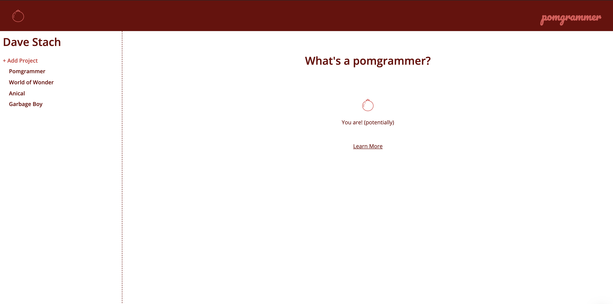
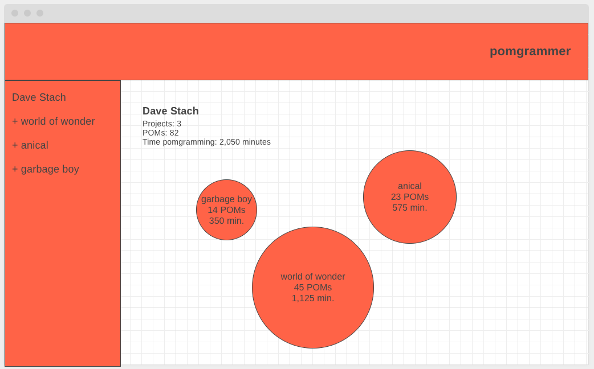

# pomgrammer



## technologies used
- Next.js, Canvas.js

## description
Pomgrammer is an idea built upon my own obsessive tendancies. I prefer to vizualize how I spend my time, whether I'm plugging the days I exercise into my Google Calendar or tracking the shows that I'm watching - I love seeing what I'm doing. Pomgrammer was an idea that, leveraging the Pomodoro Method, we can track how much time we've spent working on a given project by creating these time intervals within the scope of a current project. Using data vizualization we can then render our projects as spheres; growing in size as we add time intervals.

## dependencies
```sh
npm install
```

## initial wireframe


## next steps
This is a mock working version of the application. As I build out a database, the the app will be updated with working logic rather than psuedo database functionality.